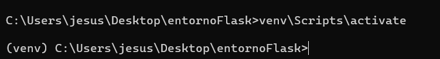
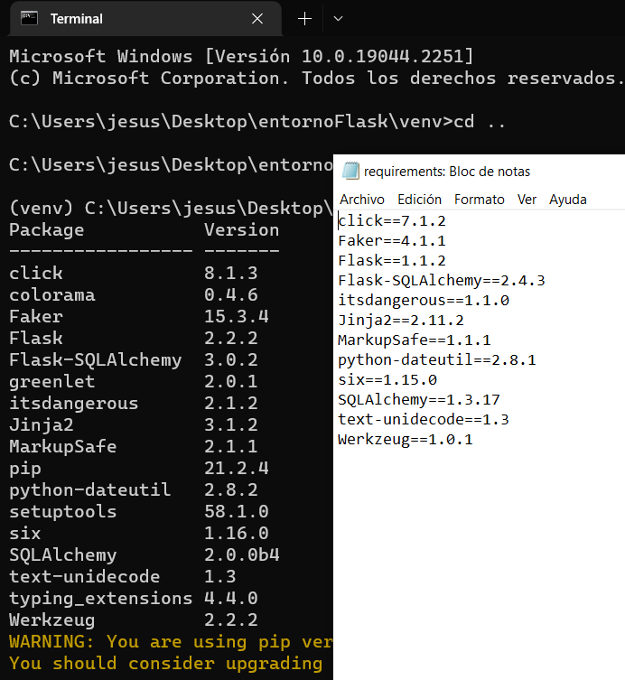
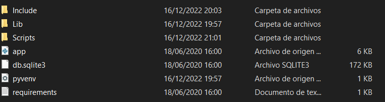
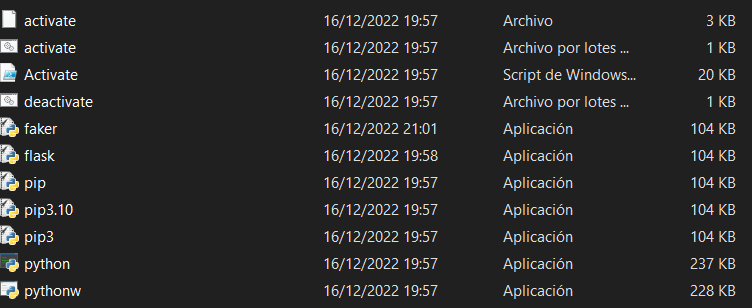

# Flask - SQL Alchemy
Para la instalación y el uso de SQL con python debemos seguir los siguientes pasos:

## Instalar Flask

Para instalar Flask primero debemos crear un entorno virtual en el escritorio, para ello ejecutamos los siguientes comandos:

~~~
mkdir entornoFlask
cd entornoFlask
py -3 -m venv venv
~~~

Después, activamos los scripts de flask:

~~~
venv\Scripts\activate
~~~

Y de esta forma ya tenemos Flask funcionando.

## Instalar SQL Alchemy

Después de tener instalado Flask, ejecutamos otra vez el siguiente comando desde el entorno virtual creado para flask:

~~~
venv\Scripts\activate
~~~

Y después instalamos SQL Alchemy versión 2.0.0b4:

~~~
pip install SQLAlchemy==2.0.0b4 
~~~

## Configuración SQLAlchemy en Python

En la página del tutorial, hay un enlace de descarga a un archivo .zip: code.zip. Tenemos que copiar los ficheros que hay dentro de code.zip y pegarlos dentro de nuestro entorno virtual venv.

En este archivo, encontraremos un fichero .py, un fichero .SQLITE3, y un fichero de texto requirements.txt.

En este archivo de texto encontraremos todo lo necesario para poder trabajar con SQLAlchemy y Flask desde python.

Ejecutando el comando:

~~~
pip list
~~~

Nos salen todos los programas dentro del entorno, comparando con el fichero requirements.txt, si vemos que nos falta alguno, lo añadimos con:

~~~
pip install *programa*
~~~

Finalmente, para poder visualizarlo correctamente desde Visual Studio Code, abrimos una terminal dentro de nuestro entorno virtual, y usamos el comando: 

~~~
code .
~~~

Se nos abrirá VSCode con el fichero donde ejecutamos el comando anterior, donde tenemos el archivo app.py. En app.py tenemos toda la configuración de nuestra base de datos. Y finalmente, instalando la extensión: SQLite, podemos visualizarlo mejor.

Finalmente, el entorno virtual (venv) nos queda de la siguiente forma:

Directorio venv:

Directorio Scripts:

